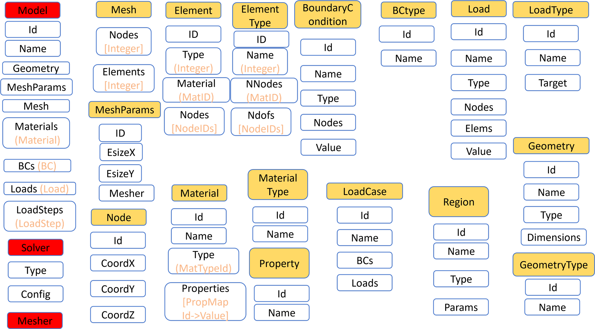
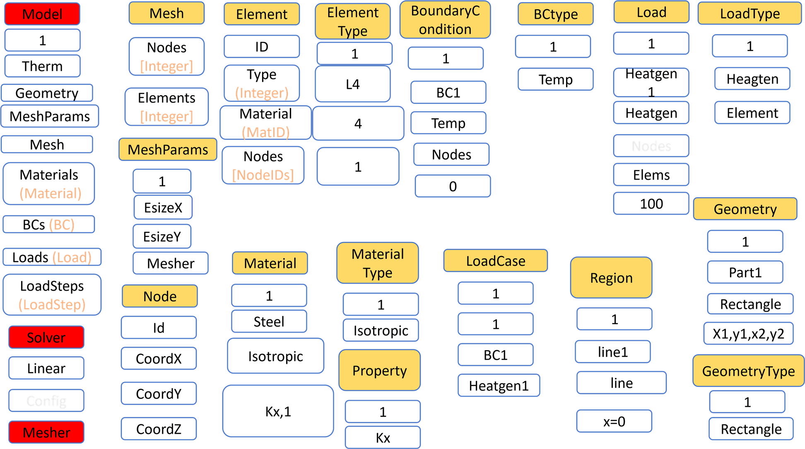
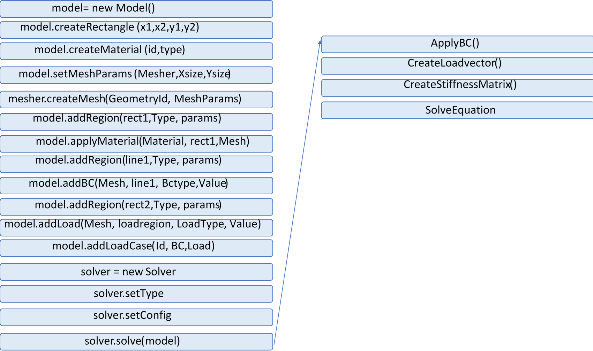

# MPU_FEM

## Диаграмма классов

___

___

## Последовательность выполнения

## Распределение задач

•	Игорь кузнецов
1)	Model
2)	Mesh
3)	MeshParams
4)	Mesher
5)	CreateMesh

•	Филькин Владимир
1)	Solver.CreateLoadVector
2)	Solver.ApplyBC
3)	Solver.CreateStiffnessMatrix
4)	Solver.Solve

•	Федор Тарасенко
1)	Region
2)	addBC
3)	addLoad
4)	addRegion

•	Ольга Панина
1)  Node
2)	Element
3)	ElementType	
      
•	Матия Гузиян-Дилбер
1)	BoundaryCondition
2)	BCtype
3)	Load
4)	LoadType

•	Всеволод Пашкин 
1)  Material
2)	MaterialType
3)	Property
4)	createMaterial

•	Виктор Сельский 
1)  Geometry
2)	GeometryType
3)	CreateRectangle

•	Роман Евсин
1)	ApplyMaterials

•	Симакина Александра 
1)	LoadCase
2)	addLoadCase
